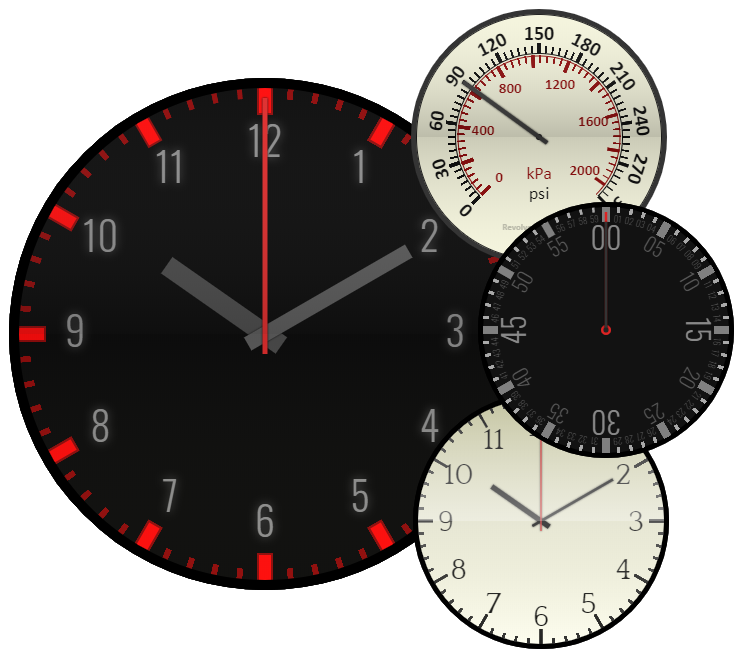

Revolve.js
===
*A precision **analog clock-and-gauge** library, animated and skinnable, in 500 lines of standard JavaScript with no dependencies.*




## Demo

Visit the [Revolve.js website](https://revolvejs.org) or check out the [`/examples`][ex] folder for code examples.


## Installation

Install with Yarn or NPM:

```bash
yarn install revolve.js

# -- or --

npm install revolve.js
```

Or download the `revolve.js` file directly.


## Use

*See the [`/examples`][ex] folder for live code examples.*

### In HTML

The quickest way to use the library is to link to the `revolve.pkgd.js` file and add a `canvas` element with the `data-revolve` attribute set to either `clock` or `gauge`.

```html
<head>
  <!-- yada yada -->
  <script src="dist/revolve.pkgd.js" type="text/javascript"></script>
  <!-- other stuff -->
</head>
<body>
  <canvas width="256" height="256" data-revolve="clock" data-theme="dark"></canvas>
</body>
```

### With JavaScript

Alternately, call the `Revolve.clock` or `Revolve.gauge` method directly in JavaScript.

```js
Revolve.clock( can.getContext("2d"), opt );
Revolve.gauge( can.getContext("2d"), opt );
```

### Specifying a Theme

Revolve.js ships with over a dozen predefined themes and the ability to define your own. The current predefined themes are:

- [`classic`](https://revolvejs.org/themes/classic)
- [`dark`](https://revolvejs.org/themes/dark)
- [`dartboard`](https://revolvejs.org/themes/dartboard)
- [`decimal`](https://revolvejs.org/themes/decimal)
- [`elite`](https://revolvejs.org/themes/elite)
- [`informatic`](https://revolvejs.org/themes/informatic)
- [`military`](https://revolvejs.org/themes/military)
- [`office`](https://revolvejs.org/themes/office)
- [`simple`](https://revolvejs.org/themes/simple)
- [`speedometer`](https://revolvejs.org/themes/speedometer)
- [`stopwatch`](https://revolvejs.org/themes/stopwatch)
- [`theory`](https://revolvejs.org/themes/theory)
- [`unitless`](https://revolvejs.org/themes/unitless)
- [`uptown`](https://revolvejs.org/themes/uptown)

To use a theme, specify the theme name in the options object...

```js
Revolve.clock(ctx, { theme: 'office' } );
Revolve.gauge(ctx, { theme: 'pressure' } );
```

...or use the `data-theme` attribute on a Revolve.js canvas:

```html
<canvas width="256" height="256" data-revolve="clock" data-theme="office"></canvas>
<canvas width="256" height="256" data-revolve="gauge" data-theme="pressure"></canvas>
```

Every Revolve.js clock and gauge is driven by an editable JSON theme description.


## Features

- **Robust on-screen rendering** of analog clocks and gauges with HTML canvas.
- **Precision alignment** and geometrical positioning of clock elements.
- **Continuous and discrete animation** with millisecond precision.
- **Custom clock and gauge axes** (for example, to implement a [pressure gauge][1]).
- **Scalable graphics** at any size or level of zoom.
- **Multiple predefined themes**, from classic office clocks to speedometers.
- **JSON-driven theming system** allows clock and gauge customization to the pixel.
- **Clean ES6 JavaScript** with a permissive MIT license and no dependencies.
- **Dedicated project website** at https://revolvejs.org.
- **Package-friendly** via Yarn and/or NPM; supports AMD, CommonJS, and browser-global approaches.


## Changelog

See [CHANGELOG.md](CHANGELOG.md) for full release info.

- v1.3.0 New theme (`theory`), better positioning and resizing support.
- v1.2.0 Improve build packaging.
- v1.1.0 Add `unitless` theme & GitHub Package support.
- v1.0.0 Initial public release.


## License

The Revolve.js library is licensed under the terms of the MIT license. Go crazy. See [LICENSE.md](LICENSE.md) for details.

*Copyright (c) 2019 | James M. Devlin | All rights reserved*

[ex]: examples/
